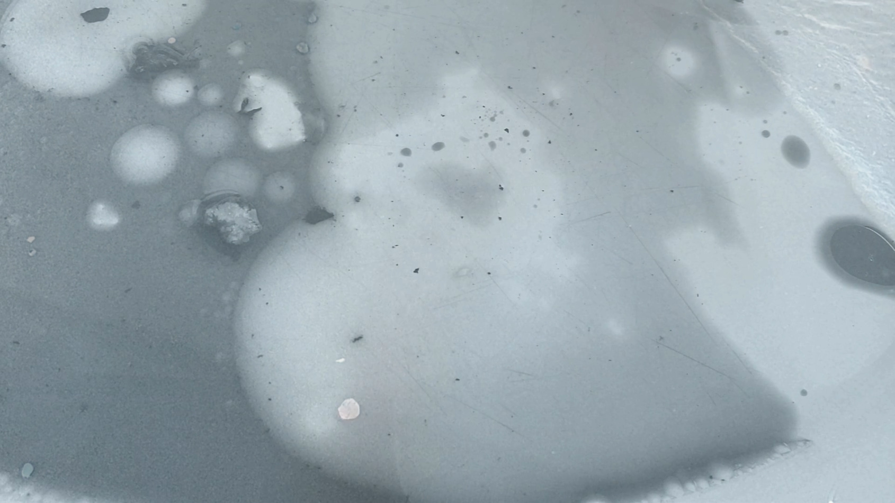

## abyss

videos: sikinos [jul 2018]\
words: τάδε έφη ζαρατούστρας, φρίντριχ νίτσε\
field recordings: sikinos [jul 2018] - agia anna, euboia [aug 2018]

---

> Ο άνθρωπος είναι ένα τεντωμένο σχοινί ανάμεσα στο ζώο και στον υπεράνθρωπο, ένα σχοινί πάνω από μια άβυσσο.
> 
> Ένα επικίνδυνο πέρασμα, ένα όλο κίνδυνο βάδισμα, ένα επικίνδυνο κοίταγμα κατά πίσω, ένα επικίνδυνο τρεμούλιασμα των ώμων και μια ακινησία.
> 
> Το πιο σπουδαίο στον άνθρωπο είναι τ' ότι γίνεται μια γέφυρα κι όχι ένας σκοπός. Το πιο αξιαγάπητο στον άνθρωπο είναι ότι γίνεται ένα πέρασμα κι ένα βασίλεμα.
> 
> Αγαπώ αυτούς που δεν ξέρουν πώς να ζήσουν εκτός κι αν η ζωή τους είναι ένα βασίλεμα, γιατί είναι αυτοί που περνούν αντίπερα.
> 
> Αγαπώ αυτούς που ξέρουν να περιφρονούν βαθιά, γιατί αυτοί είναι οι μεγάλοι λάτρες, τα τεντωμένα βέλη της δίψας για την αντίπερα όχθη.
> 
> Αγαπώ αυτούς που δεν αναζητούν πρώτα πέρα από τ' άστρα λόγους για να δύσουν και για να θυσιαστούν, μα που θυσιάζονται οι ίδιοι πάνω στη γη για να γίνει μια μέρα η γη του υπεράνθρωπου.

---

