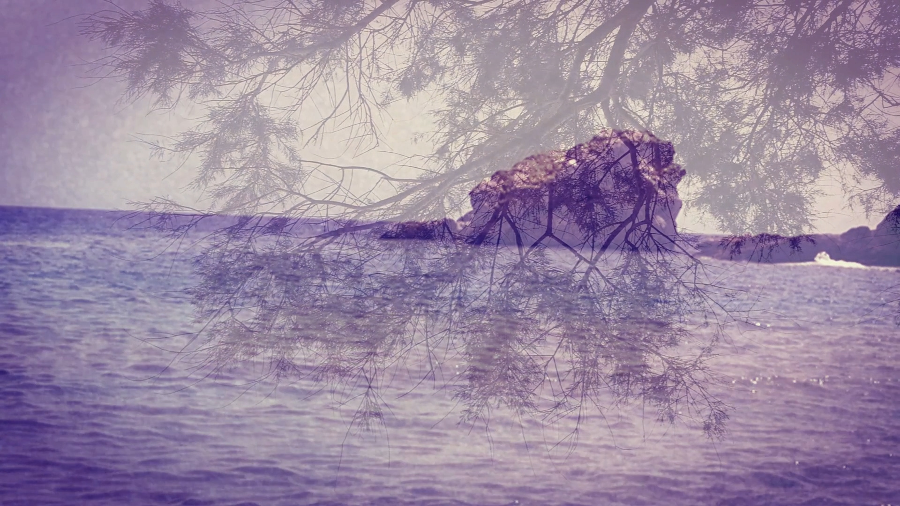

## αλμύρα

videos: sikinos [jul 2018]\
words: πριν και μετά την έρημο, cham.kor. [φανζίν χίμαιρες τ.5]\
field recordings: agia anna, euboia [aug 2018]

---

> Βρισκόταν σε μια άσχημη περίοδο.
> Ένα υγρό που σκεπάζει το μεγαλύτερο μέρος της επιφάνειας της γης.
> Χρειαζόταν μια πολύ ειδική μέθοδο ψυχοθεραπείας.
> Σχηματίζει τις θάλασσες, τις λίμνες, τα ποτάμια, τα έλη.
> Η κατάσταση ήταν άκρως μελαγχολική και απαισιόδοξη.
> Όταν θερμανθεί γίνεται ατμός -αέριο-.
> Η ειδική συσκευή ήταν έτοιμη.
> Όταν παγώσει γίνεται πάγος -στερεό-.
> Θα προκαλούσε ηλεκτρική εκφόρτιση.
> Πηγές, ρυάκια, χείμαρροι, ποτάμια.
> Διαβιβάζοντας με καλώδια στους δύο κροτάφους.
> Ομίχλη, δροσιά, πάχνη, βροχή, χιόνι, χαλάζι.
> Μικρής ισχύς, εναλλασσόμενο ηλεκτρικό ρεύμα.
> Πέφτει από τον ουρανό, κυλά από ψηλά χαμηλά.
> Για χρονικό διάστημα πολύ μικρό.
> Άλλο κατασταλάζει από τα σπλάχνα της γης.
> Προκειμένου να αποφευχθούν οδυνηρές καταστάσεις.
> Αν περάσει από πετρώματα με θειάφι ή άλλα μέταλλα.
> Και να πραγματοποιηθεί η θεραπεία χωρίς αντιδράσεις.
> Θα μας δώσει μεταλλικά ιαματικά αποτελέσματα.
> Ας προηγηθεί ένα είδος νάρκωσης με βαρβιτουρικά φάρμακα.
> Της θάλασσα είναι αλμυρό.
> Η θεραπεία αυτή.
> Της ξηράς είναι γλυκό.
> Που σε πολλές περιπτώσεις.
> Εχθρός και φίλος.
> Έχει πολύ καλά αποτελέσματα.
> Καταιγίδες, πλημμύρες, τρικυμισμένη θάλασσα.
> Εφαρμόζεται συνήθως 2-3 φορές την εβδομάδα.
> Γαλήνη στην ηρεμία πηγή που σβήνει την δίψα.
> Και συνολικά μέχρι 10 φόρες.
> Καταρράχτες, νερόμυλοι.
> Ανάλογα με την περίπτωση.
> Υδροκίνητα, υδροηλεκτρικά εργοστάσια.
> Ηλεκτρικό ρεύμα….
> Ηλεκτροσόκ…
> Νερό…
> 
> Το νερό είναι απαραίτητο στο ηλεκτροσόκ

---

