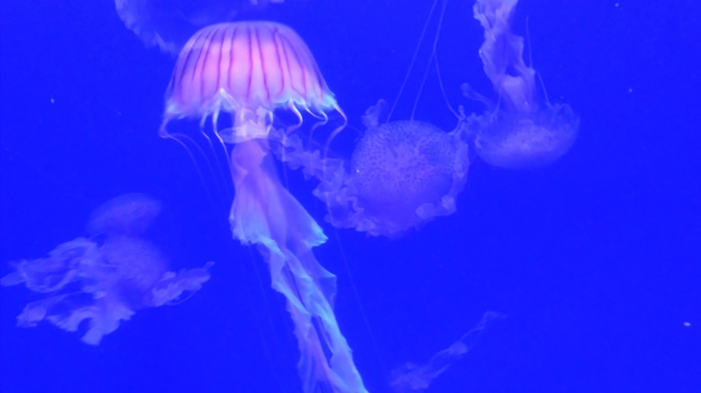

## die stille

words: das denken bei sich [hans kudszus]\
samples: bach - cello suite no. 2, perfomed by steuart pincombe\
field recordings: inside castel dell'ovo [dec 2019]

---

> Wenn wir schweigen, artikulieren wir Wörter, die wir ignorieren.
> 
> Das Geräusch der Existenz beginnt mit der Sprache:
> Jeder Vokal schreit.
> 
> Die Melodie ist wirklich da, wenn sie nicht mehr klingt.
> 
> Die grausamste Tat: das mörderische Schweigen.
> 
> Wenn Steine und Wasser, Pflanzen und Bäume erwähnenswert wären und alle Tiere in unserer eigenen Sprache zu uns sprächen, würden wir uns alle für die Schande auf Erden schämen.
> Wir leben von der Stille der Natur, die wir quälen.
> 
> Auch die Stille findet ihr Echo. Oft stärker als das Wort.

---

